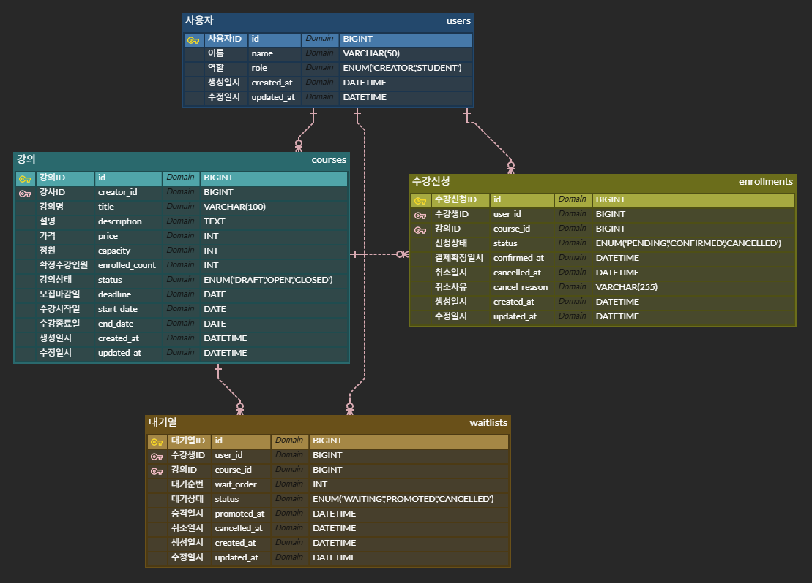

# BE-A. 수강 신청 시스템

## 1. 프로젝트 개요

온라인 강의 플랫폼의 수강 신청 시스템입니다. 강사(CREATOR)가 강의를 개설하고, 수강생(STUDENT)이 수강 신청 및 결제를 진행합니다. 수강 신청 오픈 순간 수만 명이 동시에 몰리는 상황을 Redis 큐 기반 Producer-Consumer 패턴으로 처리하며, 정원 초과 없이 안정적으로 수강 신청을 관리하는 것이 핵심 목표입니다.

---

## 2. 기술 스택


---

## 3. 실행 방법

### 사전 요구 사항

- Java 17
- Docker Desktop

### 실행

```bash
# 1. 저장소 클론
git clone https://github.com/say-hiseo/live-class.git
cd live-class/enrollment

# 2. MySQL + Redis 실행
docker-compose up -d

# 3. 애플리케이션 실행
./gradlew bootRun
```

### 접속 정보

- API 서버: `http://localhost:8080`
- Swagger UI: `http://localhost:8080/swagger-ui/index.html`

### 샘플 데이터

앱 최초 실행 시 아래 데이터가 자동 생성됩니다.

| 역할 | 이름 | ID |
|------|------|------|
| CREATOR | 김강사 | 1 |
| CREATOR | 이강사 | 2 |
| STUDENT | 박수강 | 3 |
| STUDENT | 최수강 | 4 |
| STUDENT | 정수강 | 5 |

---

## 4. 요구사항 해석 및 가정

### 1. 사용자 (Users)

- 별도 인증/인가 구현 없이 `user_id`를 요청 파라미터로 받아 사용자를 식별합니다.
- `role`이 `CREATOR`인 사용자만 강의를 개설할 수 있습니다.
    - 제목, 설명, 가격, 정원(최대 수강 인원), 수강 기간(시작일~종료일) 설정
- `role`이 `STUDENT`인 사용자만 수강 신청을 할 수 있습니다.

---

### 2. 강의 상태 전이 (Course Status)

- `DRAFT(초안) → OPEN(모집 중) → CLOSED(모집 마감)` 단방향으로만 전이 가능합니다.
- 역방향 전이(예: `OPEN → DRAFT`)는 허용하지 않습니다.
- `deadline` 이 지나면 자동으로 `CLOSED` 처리합니다.
- `DRAFT` 상태에서는 수강 신청이 불가합니다.
- `CLOSED` 상태에서는 수강 신청 및 대기열 등록이 불가합니다.
- 강의 삭제는 `DRAFT` 상태일 때만 가능합니다. `OPEN` 이후에는 삭제 불가로 가정합니다.

---

### 3. 수강 신청 상태 전이 (Enrollment Status)

- `PENDING(신청 완료, 결제 대기) → CONFIRMED(결제 완료, 수강 확정) → CANCELLED(취소됨)` 전이를 기본으로 합니다.
- `PENDING → CANCELLED`도 허용합니다. (결제 전 취소)
- `PENDING(신청 완료, 결제 대기)` 상태에서 24시간 이내 결제하지 않으면 자동 취소 됩니다.
    - `PENDING` 상태 자동 취소 시 `enrolled_count`는 변경하지 않습니다.
- 결제가 완료되어야 수강 확정이 됩니다.
- `CONFIRMED → CANCELLED`는 결제 확정 후 7일 이내에만 가능합니다.
- 이미 `CANCELLED`된 신청은 재신청 가능합니다. (새로운 enrollment 생성)
- 동일 강의에 `PENDING` 또는 `CONFIRMED` 상태의 신청이 이미 존재하면 중복 신청 불가합니다.

---

### 4. 정원 관리 및 동시성 제어

- 정원 초과 시 수강 신청은 거부되며 대기열 등록을 안내합니다.
- `enrolled_count`는 `CONFIRMED` 상태 기준으로 관리합니다. (`PENDING`은 포함하지 않음)
- 정원이 꽉 차도 `OPEN` 상태는 유지됩니다.
    - 취소로 자리가 생기면 → 대기자 있으면 자동 승격, 없으면 일반 신청 가능
    - 즉 `CLOSED`는 오직 `deadline` 초과로만 전환됩니다.
- 동시에 여러 사용자가 마지막 자리에 신청하는 경우 **Redis List 기반 Producer-Consumer 패턴**으로 처리합니다.
    - 수강 신청 요청이 들어오면 즉시 DB에 접근하지 않고 Redis Queue에 적재합니다.
    - Consumer가 큐에서 요청을 순차적으로 꺼내 처리하여 DB 동시 접근을 원천 차단합니다.
    - 응답 방식은 "신청이 접수됐습니다" 즉시 반환 → 클라이언트는 상태 조회 API로 확정 여부를 확인합니다.
    - 비관적 락은 Consumer의 DB 처리 단계에서 추가로 적용하여 이중 안전장치로 활용합니다

---

### 5. 대기열 (Waitlist)

- 정원이 꽉 찬 `OPEN` 상태의 강의에만 대기열 등록이 가능합니다.
- 동일 강의에 `WAITING` 상태의 대기가 이미 존재하면 중복 등록 불가합니다.
- `wait_order`는 등록 시점 기준으로 자동 부여합니다. (현재 최대 순번 + 1)
- 수강 취소 발생 시 해당 강의의 `wait_order`가 가장 낮은 대기자를 자동으로 `PENDING` 상태의 enrollment로 승격합니다.
- 대기자 승격 시 `waitlists.status`는 `PROMOTED`로 변경합니다.
- 대기자 승격으로 생성된 `PENDING`도 동일하게 24시간 내 미결제 시 자동 취소됩니다.
    - 자동 취소 시 다음 대기자를 자동 승격합니다.
- 대기열은 `OPEN` 상태인 강의에서만 유지되며, 강의가 `CLOSED`되면 남은 대기자는 자동 취소 처리합니다.

---

### 6. 취소 가능 기간 제한

- `CONFIRMED` 상태 기준으로 `confirmed_at`으로부터 **7일 이내**에만 취소 가능합니다.
- 7일 초과 시 취소 요청을 거부하고 명확한 오류 메시지를 반환합니다.

---

### 7. 페이지네이션

- 내 수강 신청 목록, 강의 목록, 강의별 수강생 목록 조회에 페이지네이션을 적용합니다.
- 강의 목록 조회 시 초안, 모집 중, 모집 마감, 강사, 가격에 따른 상태 필터가 가능하도록 합니다.
- 강의 상세 조회 시 현재 신청 인원(=확정 인원)을 포함한 강의 정보를 제공합니다.
- 강의별 수강생 목록 조회는 `role`이 `CREATOR`인 사용자만 가능합니다.
- 기본값: `page=0`, `size=10`으로 설정합니다.
- 정렬 기준: `created_at` 내림차순을 기본으로 합니다.

---

### 8. 결제 처리

- 외부 결제 시스템 연동 없이 API 호출로 상태를 `PENDING → CONFIRMED`으로 변경하는 방식으로 대체합니다.
- 결제 확정 시 `confirmed_at`을 현재 시각으로 기록합니다.
- 결제 확정 시 정원이 초과된 경우 확정을 거부합니다.
    - 결제 확정 시점에 정원 초과면 결제를 거부하고 `PENDING`을 `CANCELLED`로 변경
    - 사용자에게 "정원이 마감되어 결제가 취소됐습니다" 안내
    - 대기열 등록 안내
- 결제 확정 시 `courses.enrolled_count`를 1 증가시킵니다.
- 수강 취소`(CONFIRMED → CANCELLED)` 시 `courses.enrolled_count`를 1 감소시킵니다.

---

## 5. 설계 결정과 이유

### 아키텍처: 헥사고날 + MVC + Rich Domain Model + DTO 분리

```
presentation (Controller)
    ↓
domain
  ├── port/in (UseCase 인터페이스)
  ├── service (비즈니스 로직)
  ├── model (Rich Domain Model)
  ├── dto (요청/응답 DTO)
  └── port/out (Repository 인터페이스)
        ↑
infrastructure (JpaEntity, JpaRepository, Adapter)
```

**헥사고날 아키텍처를 선택한 이유:**

도메인 로직이 외부 기술(JPA, Redis)에 의존하지 않도록 분리하기 위해 선택했습니다. Port-Adapter 패턴 덕분에 테스트 시 Mock으로 교체가 용이하고, 나중에 저장소 기술을 교체해도 도메인 코드 변경 없이 Adapter만 교체하면 됩니다.

**Rich Domain Model을 선택한 이유:**

`DRAFT → OPEN → CLOSED`, `PENDING → CONFIRMED → CANCELLED` 같은 상태 전이 규칙을 Service가 아닌 도메인 모델 안에 표현했습니다. `course.open()`, `enrollment.confirm()`, `enrollment.cancelByConfirmed()` 같은 메서드로 비즈니스 규칙이 응집되어 가독성과 테스트 용이성이 높아집니다.

**JPA Entity와 도메인 모델 분리:**

`CourseJpaEntity`와 `Course`(도메인 모델)를 분리하고 Adapter에서 변환합니다. JPA 어노테이션이 도메인 로직에 침투하지 않아 도메인 모델이 순수한 자바 객체로 유지됩니다.

### 동시성 제어: Redis List 기반 Producer-Consumer 패턴

수강 신청 오픈 순간 수만 명이 동시에 요청하는 상황에서 DB 직접 처리로는 Deadlock과 커넥션 고갈이 발생합니다.

**설계 결정:**

1. **Producer**: 수강 신청 요청을 Redis List 큐에 적재 후 requestId를 즉시 반환합니다. 클라이언트는 결과 조회 API로 폴링합니다.
2. **Consumer**: `@Scheduled(fixedDelay = 100)`으로 100ms마다 큐에서 요청을 꺼내 순차적으로 DB에 반영합니다. DB 동시 접근을 원천 차단합니다.
3. **비관적 락(이중 안전장치)**: Consumer의 DB 처리 단계에서도 `SELECT FOR UPDATE`로 정원 초과를 이중으로 방지합니다.

**Redis 큐를 선택한 이유:**

- DB 직접 처리 시 트랜잭션 경합으로 Deadlock 발생
- 낙관적 락은 충돌 시 재시도가 필요해 사용자 경험에 영향
- Redis 큐로 요청을 순차화하면 DB 부하가 대폭 감소

**파이프라이닝 적용:**

Producer 단계에서 `executePipelined`를 사용해 큐 적재(rPush)와 결과 초기화(setEx)를 단일 네트워크 통신으로 처리합니다. Mock 환경에서는 개별 명령으로 자동 폴백합니다.

### Kafka 확장 설계 고려 (미구현)

현재 Redis Queue와 Kafka Topic은 1:1 대응 구조로 설계되어 있어 교체 시 Producer/Consumer 인터페이스 변경을 최소화할 수 있습니다.

Kafka 전환 시 적용할 설정:

```
파티션 전략: course_id 기준 파티셔닝 → 같은 강의의 신청은 동일 파티션에서 순서 보장
메시지 유실 방지: acks=all, enable.idempotence=true → 정확히 한 번 처리 보장
```

---

## 6. 미구현 / 제약사항

### 과제 명세에 따라 의도적으로 제외한 항목

| 항목 | 사유 |
|------|------|
| 인증/인가 (JWT, OAuth) | 과제 명세에서 제외 명시. `X-User-Id` 헤더로 대체 |
| 외부 결제 연동 | 과제 명세에서 제외 명시. API 호출로 상태 변경 |

### 기술적 제약사항

| 항목 | 현재 상태 | 개선 방향 |
|------|------|------|
| Consumer 단일 스레드 | `@Scheduled`로 단일 Consumer 운영 | Kafka 전환 시 다중 Consumer 가능 |
| Redis 단일 노드 | 로컬 Docker Redis 사용 | Redis Cluster 또는 Sentinel로 확장 |
| 수강 신청 결과 폴링 방식 | requestId로 결과 조회 | WebSocket 또는 SSE로 push 방식 전환 가능 |

---

## 7. API 목록 및 예시

> **Swagger UI**: `http://localhost:8080/swagger-ui/index.html`
>
> 모든 API는 `X-User-Id` 헤더로 사용자를 식별합니다.

### 강의 API

| Method | URL | 설명 | 권한 |
|--------|-----|------|------|
| POST | `/courses` | 강의 등록 | CREATOR |
| PUT | `/courses/{courseId}` | 강의 수정 (DRAFT만) | CREATOR (본인) |
| DELETE | `/courses/{courseId}` | 강의 삭제 (DRAFT만) | CREATOR (본인) |
| PATCH | `/courses/{courseId}/open` | 강의 오픈 (DRAFT → OPEN) | CREATOR (본인) |
| GET | `/courses` | 강의 목록 조회 (상태 필터, 페이지네이션) | 누구나 |
| GET | `/courses/{courseId}` | 강의 상세 조회 | 누구나 |
| GET | `/courses/{courseId}/students` | 강의별 수강생 목록 | CREATOR (본인) |

#### 강의 등록 예시

```http
POST /courses
X-User-Id: 1
Content-Type: application/json

{
  "title": "Spring Boot 입문",
  "description": "Spring Boot 기초부터 실전까지",
  "price": 50000,
  "capacity": 30,
  "startDate": "2026-07-01",
  "endDate": "2026-07-31",
  "deadline": "2026-06-25"
}
```

```json
{
  "success": true,
  "message": "강의가 등록됐습니다.",
  "data": {
    "id": 4,
    "title": "Spring Boot 입문",
    "status": "DRAFT",
    "capacity": 30,
    "enrolledCount": 0
  }
}
```

### 수강 신청 API

| Method | URL | 설명 | 권한 |
|--------|-----|------|------|
| POST | `/enrollments` | 수강 신청 (큐 적재 → requestId 반환) | STUDENT |
| GET | `/enrollments/result/{requestId}` | 수강 신청 결과 조회 | - |
| PATCH | `/enrollments/{enrollmentId}/confirm` | 결제 확정 (PENDING → CONFIRMED) | STUDENT (본인) |
| PATCH | `/enrollments/{enrollmentId}/cancel` | 수강 취소 | STUDENT (본인) |
| GET | `/enrollments/my` | 내 수강 신청 목록 | STUDENT |
| GET | `/enrollments/{enrollmentId}` | 수강 신청 단건 조회 | STUDENT (본인) |
| POST | `/enrollments/waitlist` | 대기열 등록 | STUDENT |
| PATCH | `/enrollments/waitlist/{waitlistId}/cancel` | 대기열 취소 | STUDENT (본인) |
| GET | `/enrollments/waitlist/my` | 내 대기열 조회 | STUDENT |

#### 수강 신청 플로우 예시

**1단계: 수강 신청 요청**

```http
POST /enrollments
X-User-Id: 3
Content-Type: application/json

{ "courseId": 2 }
```

```json
{
  "success": true,
  "message": "신청이 접수됐습니다. requestId로 결과를 확인해주세요.",
  "data": "a1b2c3d4-e5f6-7890-abcd-ef1234567890"
}
```

**2단계: 결과 조회 (폴링)**

```http
GET /enrollments/result/a1b2c3d4-e5f6-7890-abcd-ef1234567890
```

```json
{
  "success": true,
  "data": {
    "requestId": "a1b2c3d4-e5f6-7890-abcd-ef1234567890",
    "status": "SUCCESS",
    "message": "수강 신청이 완료됐습니다. 24시간 내 결제를 완료해주세요.",
    "enrollmentId": 1
  }
}
```

**3단계: 결제 확정**

```http
PATCH /enrollments/1/confirm
X-User-Id: 3
```

```json
{
  "success": true,
  "message": "결제가 확정됐습니다.",
  "data": {
    "id": 1,
    "status": "CONFIRMED",
    "confirmedAt": "2026-06-01T03:30:00"
  }
}
```

### 공통 에러 응답

```json
{
  "statusCode": 409,
  "error": "CONFLICT",
  "message": "이미 신청한 강의입니다."
}
```

---

## 8. 데이터 모델 설명 (ERD)

### ERD


### 관계

모든 관계는 Non-Identifying (비식별 관계)이며 1 : Zero or One or Many 관계입니다.

| 관계 | 설명 |
|------|------|
| users → courses | 강사 한 명이 여러 강의 개설 가능 |
| users → enrollments | 수강생 한 명이 여러 강의 신청 가능 |
| courses → enrollments | 강의 하나에 여러 신청 가능 |
| users → waitlists | 수강생 한 명이 여러 강의 대기 가능 |
| courses → waitlists | 강의 하나에 여러 대기자 가능 |

### 설계 결정 사항

**`enrolled_count` 캐시 컬럼**: 매번 `COUNT(*)` 쿼리를 실행하는 대신 확정 인원을 `courses` 테이블에 캐시합니다. 결제 확정 시 +1, 수강 취소 시 -1로 관리합니다.

**`waitlists` 별도 테이블**: `enrollments`에 `WAITLISTED` 상태를 추가하는 방법도 있지만, 대기열은 수강 신청과 독립적인 라이프사이클을 가지므로 별도 테이블로 분리했습니다.

---

## 9. 테스트 실행 방법

### 전체 테스트 실행

```bash
./gradlew clean test
```

### 테스트 종류별 실행

```bash
# 단위 테스트 (Mock 사용, Redis/DB 불필요)
./gradlew clean test --tests "com.example.enrollment.domain.*"

# 통합 테스트 (H2 인메모리 DB + Mock Redis)
./gradlew clean test --tests "com.example.enrollment.presentation.*"

# 부하 테스트 (실제 Redis 필요 - Docker 실행 후 테스트)
./gradlew clean test --tests "com.example.enrollment.concurrency.*"
```

> **주의**: 부하 테스트는 실제 Redis를 사용합니다. `docker-compose up -d` 후 실행해주세요.
>
> 부하 테스트 완료 후 Redis 큐를 정리합니다:
> ```bash
> docker exec -it enrollment-redis redis-cli FLUSHDB
> ```

### 테스트 현황

| 분류 | 테스트 클래스 | 건수 |
|------|------|------|
| 단위 테스트 | CourseServiceTest | 6 |
| 단위 테스트 | EnrollmentServiceTest | 7 |
| 단위 테스트 | WaitlistServiceTest | 8 |
| 통합 테스트 | CourseApiTest | 4 |
| 통합 테스트 | EnrollmentApiTest | 12 |
| 부하 테스트 | EnrollmentConcurrencyTest | 2 |
| **합계** | | **39** |

### 부하 테스트 결과

50,000건 동시 수강 신청 테스트 (`EnrollmentConcurrencyTest`)

```
총 요청: 50,000건
큐 접수(202): 23,251건
중복 거부(409): 26,749건  ← 100명 수강생 순환으로 인한 정상적인 중복 방지
오류: 0건
처리 시간: ~13초
강의 정원: 1명
정원 초과 확정: 0건 ✅
```

- 100명의 수강생이 순환하며 50,000번 요청 → 중복 방지 정상 동작 확인
- 정원(1명) 초과 없이 모든 요청 정상 처리 확인

---

## 10. AI 활용 범위

본 과제에서 Claude AI를 설계 검토 및 문서 작성 보조 도구로 활용했습니다.

<details>
<summary>아키텍처 설계</summary>

헥사고날 아키텍처와 Rich Domain Model 조합을 검토하는 과정에서 AI와 트레이드오프를 논의했습니다.
AI는 초기에 Layered Architecture + Rich Domain Model을 추천했으나, 상태 전이 규칙이 복잡하고
도메인 로직을 외부 기술로부터 완전히 분리하고 싶어 헥사고날 아키텍처로 직접 결정했습니다.
이를 바탕으로 패키지 구조 초안을 설계했지만, `domain` 패키지 내 `dto` 폴더 위치와
JPA Entity와 도메인 모델 분리 방식(Mapper 패턴)은 직접 검토하여 확정했습니다.

</details>

<details>
<summary>ERD 설계</summary>

테이블 구조와 관계 정의 과정에서 AI의 검토를 받았습니다.
`waitlists` 테이블을 `enrollments`에 통합할지 분리할지, `deadline` 컬럼을 별도로 둘지 여부를
고민했고 AI를 활용하여 각 방식의 장단점을 분석하여 결정했습니다.
`enrolled_count` 캐시 컬럼의 관리 기준(CONFIRMED 기준, PENDING 미포함)도 직접 요구사항을 해석하고 확정했습니다.

</details>

<details>
<summary>동시성 제어 방식 선택</summary>

Redis 큐, 비관적 락, 낙관적 락의 트레이드오프 분석에 AI를 활용했습니다.
Redis 큐, 비관적 락, 낙관적 락 뿐만 아니라 kafka와 MSA까지 고려하고 있다는 점을 알려
AI가 각 방식의 장단점을 정리해줬고, 수강 신청 특성상 충돌 가능성이 높아
낙관적 락의 재시도 방식이 적합하지 않다고 직접 판단했습니다.
kafka와 MSA는 구현의 난이도나 개발 기간을 고려하여 적합하지 않다고 판단했습니다.
최종적으로 Redis 큐로 요청을 순차화하고 Consumer DB 처리 단계에서
비관적 락을 이중 안전장치로 적용하는 구조는 직접 결정했습니다.
Redis 파이프라이닝 적용 범위(Producer 단계만)와 Mock 환경 폴백 처리도
직접 구현하며 트러블슈팅했습니다.

</details>

<details>
<summary>테스트 전략</summary>

단위/통합/부하 테스트 범위와 전략 수립에 AI를 활용했습니다.
Mock Redis 환경의 한계로 파이프라이닝 코드가 통합 테스트에서 NPE를 발생시키는 문제를
직접 원인을 파악하고 폴백 로직을 추가하여 해결했습니다.
부하 테스트에서 `@Transactional`로 인해 Consumer가 강의를 찾지 못하는 문제,
`@ActiveProfiles("load-test")` 프로파일 분리 필요성도 직접 트러블슈팅하여 결정했습니다.

</details>

<details>
<summary>Kafka 확장 설계</summary>

Redis Queue와 Kafka의 1:1 대응 구조 설계와 파티션 전략은 AI와 함께 검토했습니다.
`course_id` 기준 파티셔닝으로 같은 강의의 신청 순서를 보장하는 방식과
`acks=all`, `enable.idempotence=true` 설정의 의미는 직접 학습하고 이해한 후 문서에 반영했습니다.

</details>

<details>
<summary>README 작성</summary>

전체 구조와 초안은 AI가 제시했으나, 요구사항 해석 및 가정 항목은
과제 명세를 직접 분석하여 작성했고, 설계 결정 이유와 미구현 항목은
실제 구현 과정에서 내린 판단을 직접 서술했습니다.

</details>